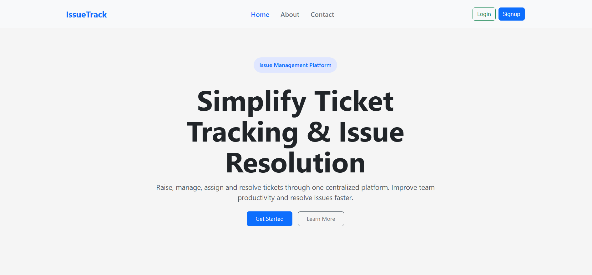
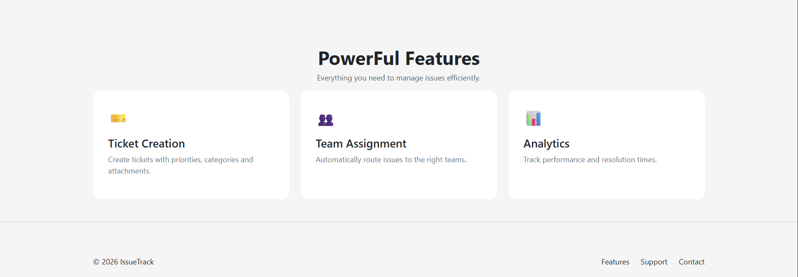

IssueTrack 
    -Issue track is a web application that supports issue tracking and management in a proffesstional Environment 
    -it supports both Users and Admins where users can raise Issues and Admins can respond to them 
    
    
    
Features 
    -Users 
        -Users can create an account and use those credentials to login into the application 
        
        
        

        -The user Interface / dashboard is a user friendly interface where they can easily navigate 
        
        -It supports features like 
            -Raise Ticket 
                -users can raise an issue using this feature , they can provie informations like issue title , description etc..
                 
            -Track issues 
                -This feature allows users to track the progress of the issues they have raised 
                
            -Manage Profile 
                -This feature allows users to View and update their Personal information 
                
            -Logout 
                -This feature is used to logout the user 
                
            -Dashboard 
                -This page has all the Important Informations about Users Issues summarized 
                
    
    -Admin 
        -Unlike users , Admins cannot directly create accounts and it is done at database level by the admins 
        -Admins can login with their credentials 
        -The admin has Features like 
            -Admin Dashboard 
                -the Admin Dashboard has all the Necessary and Important details Summarized . It includes details about Both Issues and Users like total number of users and Isues . it also has statistics like number of pending / resolved issues and also the resolved Rate . 
                -The dashBoard also has recent issues where admin can view recently raised issues
            -Admin Users 
                - This feature allows admins to view all the employees in the organisation and it also has filtering and searching options 
            -Admin Issues 
                -This is one of the Important features of this application . This feature allows admins to respond to the issues raised by the users . it displays all the details of the issues and also features to respond to the issues . 
                - The admins can change the status of a issue and also can enter remarks which allows the user to understand the 
                progress of thier issues clearly 
            -Logout 
                -It is used to logout the admin 

Technical View 
-All the pages in the IssueTrack is fully responsive and had user friendly Interface . It is fully adaptable to all screen sizes 

-Register Page
    -this page is used to create a new account 
    -It has inline dynamic error message which will show or hide dynamically 
    -It uses Javascript Regular Expressions to validate the user input and only allow valid values 
    -It also checks for duplicate account and Prevents duplicate accounts 
    -On successful Account Creation, it shows a toaster with success message

-Login page 
    -The login page to used to allow authenticated users inside the application 
    -The login page supports 2 types of login One is user login and the other is admin login 
    - It gets the credentials from the users and checks it with the stored crendials and if the details matches it allows the user inside the application 
    -On successful login it shows a toaster with success message

-User Dashboard 
    -User dashboard page is a colorful pages with multiple features 
    -The Raise ticket feature is used to raise a issue , It uses Bootstrap modal for this Feature . It also displays toaster messages for successful or invalid issue submission. 
    -The Manage Profile feature also uses Bootstrap modal to display the user profile in a compact way 
    -The track Issues feature navigates user to the user Issues page . 
    -The users statistics shows the important details and it also uses a special technique . The User Issue page is dynamically filtered based on the dashboard card which is clicked (eg when issues resolved card is clicked it navigates to the user tickets page and automatically only resolved issues are displayed) . Local storage is used here to store the users preference and user Issues page is filtered accordingly , 
    -The logout button is available via the profile icon which uses bootstrap offcanvas and it also has all the features mentioned above . When logout button is clicked it displays a conformation message via sweet alert and on click yes , the user will be logged otu 

-User Issues 
    -This page shows all the issues raised by the users with its current status and remarks 
    -This page has a feature to search issues and also filters to easily view specific issues 

--Admin Dashboard
    --Admin Dashboard has all the statistics about the organisation's users and issues 
    --It has the dynamic filtering feature as mentioned above where a page is automatically filtered based on the option user clicks on the dashboard page . 
    --It also displays 5 most recent issues in a table 

--Admin Users 
    -This page Displays all the employees in the organisation 
    -It has filter by department feature to filter employees 
    -It also has Search feature 

--Admin Issues 
    -This page allows admin to View and Update Issues 
    -THe Edit Option uses Bootstrap modal and allows admin to change status and add remarks . 
    -This page demonstrates various filtering options , it supports date filtering in which we can input a from date and to date . then it filters issues reported between that dates . it has filter by priority and filter by status . 
    It also has a dynamic search feature which allows the admins to search issues by title . 

--Logout 
    -the logout uses SweetAlerts for comformation and on conformation it logout the admin . 

